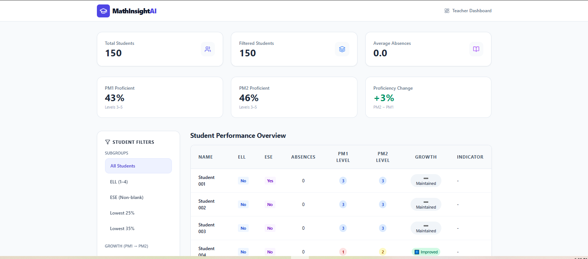
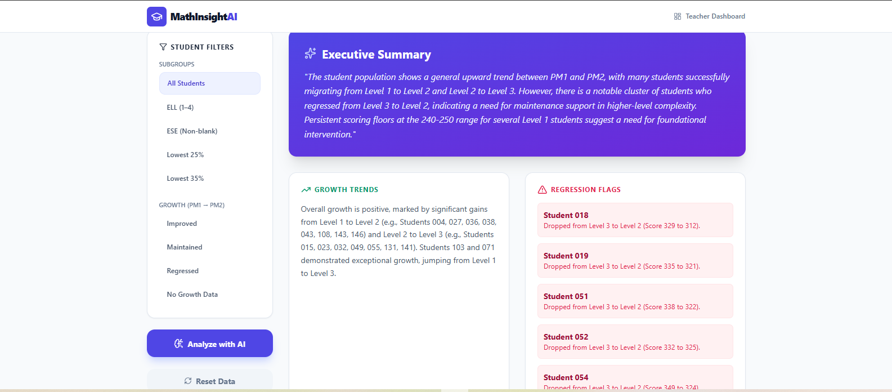
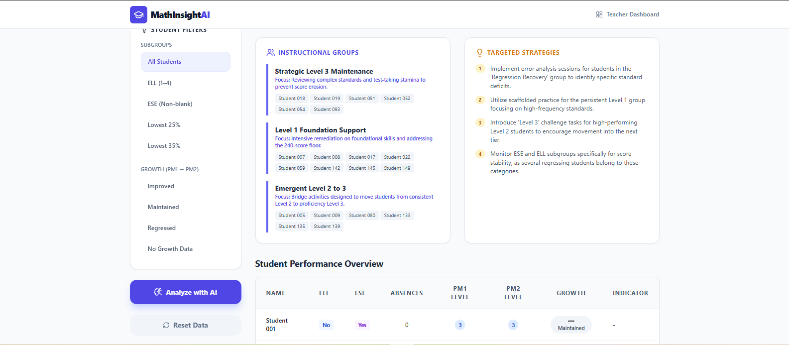

# MathInsight AI

AI-driven instructional insights from Florida B.E.S.T. Standards Progress Monitoring data. Built with React, Node.js, and the Gemini API.

**Live demo:** https://ai.studio/apps/drive/14veanVCFsZjIAmRZlgkEz-kmKVJ3uOA1?fullscreenApplet=true

## Screenshots

**Dashboard with KPI cards and subgroup filters**

**AI-generated executive summary and regression flags**

**Instructional groups and targeted strategies**

## The problem

Florida students take three Progress Monitoring assessments each year: PM1, PM2, and PM3. PM3 is the final score. Once PM2 results come in, I have one window to figure out which students improved, which dropped, and where my Lowest 25% and Lowest 35% stand before they sit for PM3. Then I have to build instructional groups around what the data shows me. I do this analysis by hand in Excel for every student I teach. The state reports tell me who passed PM2. They don't tell me which students need intervention now to score proficient on PM3. I built MathInsight because the work I was doing by hand after PM2 is the kind of work software should do in seconds.

## What it does

MathInsight takes a Florida B.E.S.T. PM export (CSV or XLSX) and produces three layers of output:

- **Diagnostic** — proficiency rates for PM1 and PM2, change between windows, regression flags with specific student IDs, and score drops, subgroup breakdowns (ELL, ESE, L25, L35).
- **Narrative** — AI-generated executive summary, growth trends analysis, and subgroup commentary in plain English.
- **Action** — instructional groupings (Accelerated Mastery, Strategic Growth, Intensive Foundational Support, Regression Recovery) and targeted strategy recommendations that a teacher can use the next school day.

## Built with

- **Frontend:** React + TypeScript
- **Backend:** Node.js
- **AI:** Google Gemini via the Gemini API
- **Development:** Google AI Studio Build mode
- **Data:** Synthetic dataset modeled on the Florida B.E.S.T. PM export schema

## Data privacy

This project never uses real student data. The included dataset is synthetic — generated to match the structure, value ranges, and realistic distributions of a Florida B.E.S.T. PM export, but containing no actual student records. Uploaded data is held in browser memory only; it is never persisted to a database or sent anywhere except the Gemini API for the analysis call. **FERPA-compliant by design.**

## Run locally

**Prerequisites:** Node.js

1. Install dependencies: `npm install`
2. Set `GEMINI_API_KEY` in `.env.local` to your Gemini API key
3. Run the app: `npm run dev`

## About

Built by Karla Lopez — middle school math teacher (15 years, Miami-Dade County Public Schools), Navy veteran, and dual bachelor's student in Data Analytics + Applied AI at Miami Dade College (Spring 2027).
